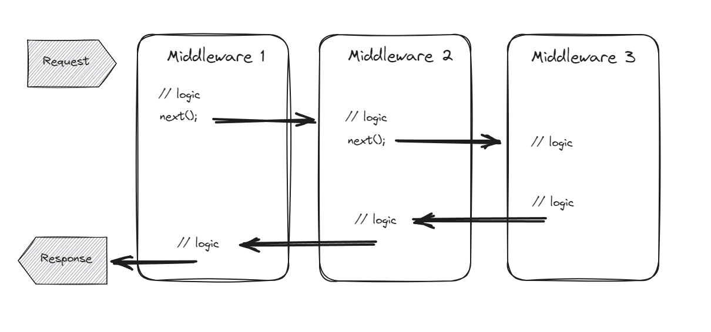
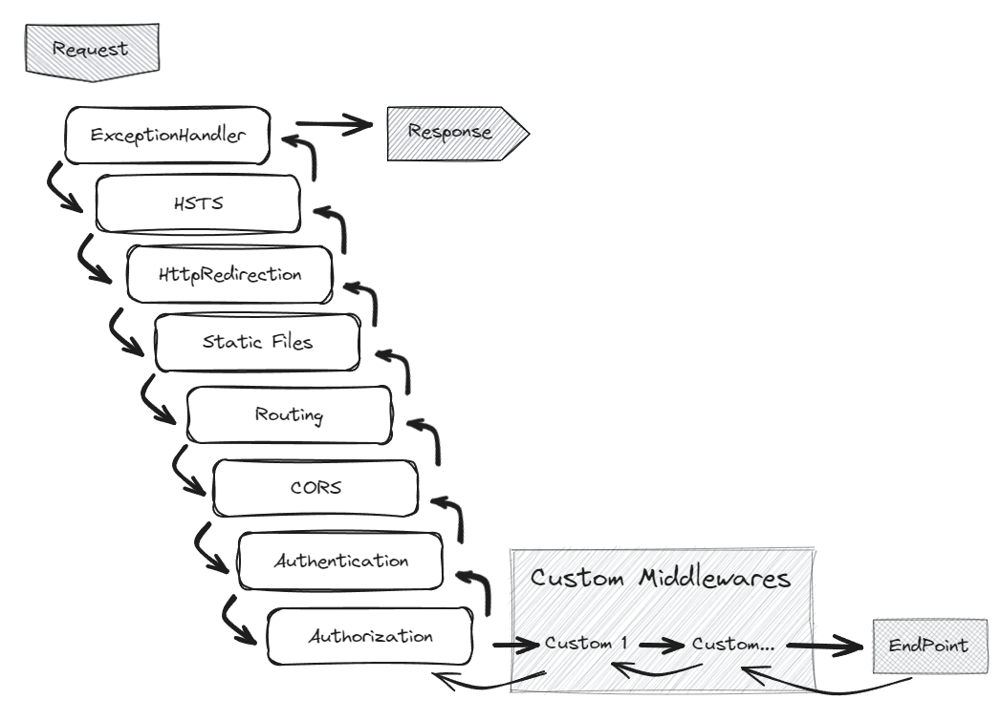

# Middlewares
- Los middlewares son capas intermedias entre el cliente (navegador o aplicación) y la aplicación web o servidor.
- Actúan como filtros o manipuladores que procesan las solicitudes antes de que lleguen a la lógica principal de la aplicación o después de que se generen las respuestas.
- Son una serie de instrucciones de código que se agregan al ciclo de vida de una petición HTTP.
- Posibilitan la implementación de interceptores y filtros sobre las peticiones en una API.

## Funciones principales
### Procesamiento previo (pre-request)
Antes de que una solicitud llegue al controlador o la lógica de la aplicación, los middlewares pueden realizar tareas como:
- **Autenticación**: Verificar la identidad del usuario o validar tokens.
- **Autorización**: Determinar si el usuario tiene permiso para acceder a ciertos recursos.
- **Logging**: Registrar información sobre la solicitud entrante.
- **Manipulación de encabezados**: Agregar, modificar o eliminar encabezados HTTP.
- **Compresión**: Comprimir datos antes de enviarlos al cliente.

### Procesamiento posterior (post-response)
Después de que se genera una respuesta, los middlewares pueden realizar acciones como:
- **Caché**: Almacenar en caché respuestas para futuras solicitudes.
Compresión de respuesta: Comprimir la respuesta antes de enviarla al cliente.
- **Manipulación de cookies**: Agregar o modificar cookies.
- **Redirecciones**: Redirigir a otra URL según ciertas condiciones.

## Ejemplos
Supongamos que tienes una aplicación web que requiere autenticación. Puedes usar un middleware de autenticación para verificar si el usuario está autenticado antes de permitir que la solicitud llegue al controlador correspondiente.

Otro ejemplo es el middleware de registro (logging), que registra detalles sobre cada solicitud entrante, como la URL, el método HTTP y la dirección IP del cliente.

## ASP.NET Core y Middleware
En ASP.NET Core, los middlewares se agregan al pipeline de solicitud en el archivo Startup.cs.

Puedes agregar middlewares personalizados o utilizar los proporcionados por ASP.NET Core, como el middleware de autenticación, el middleware de enrutamiento y el middleware de manejo de errores.

En resumen, los middlewares son piezas clave para extender y personalizar el procesamiento de solicitudes y respuestas en aplicaciones web. Permiten modularidad, reutilización y flexibilidad al interactuar con el flujo de datos entre el cliente y el servidor.

## Esquema básico de un Middleware



## Orden Middlewares en .NET

En ASP.NET Core 8, los middlewares son componentes esenciales que se ensamblan en un pipeline de aplicación para manejar solicitudes y respuestas. Cada middleware tiene un papel específico en el procesamiento de las solicitudes. A continuación, te presento los middlewares por defecto junto con una breve descripción y su orden en el pipeline:



1. UseExceptionHandler
   - Descripción: Este middleware captura excepciones no controladas y genera respuestas de error adecuadas.
   - Orden: Debe estar cerca del principio del pipeline para manejar errores tempranos.
2. UseHsts (HTTP Strict Transport Security)
    - Descripción: Agrega encabezados HSTS a las respuestas para forzar conexiones seguras (HTTPS) durante un período de tiempo especificado.
    - Orden: Antes de UseHttpsRedirection para garantizar que las redirecciones también sean seguras.
3. UseHttpsRedirection
    - Descripción: Redirige las solicitudes HTTP a HTTPS.
    - Orden: Después de UseHsts.
4. UseStaticFiles
    - Descripción: Sirve archivos estáticos (como CSS, imágenes o JavaScript) directamente desde el sistema de archivos.
    - Orden: Después de UseHttpsRedirection.
5. UseRouting
    - Descripción: Configura el enrutamiento de solicitudes a controladores y acciones.
    - Orden: Después de UseStaticFiles.
6.  UseAuthentication
    - Descripción: Autentica las solicitudes entrantes.
    - Orden: Después de UseRouting.
7. UseAuthorization
    - Descripción: Realiza la autorización basada en políticas.
    - Orden: Después de UseAuthentication.
8. Custom Middlewares 📝
    - Este sería el sitio ideal para colocar nuestro middleares personalizados
9.  UseEndpoints
    - Descripción: Configura cómo se manejan las solicitudes entrantes (por ejemplo, invocando controladores o middleware).
    - Orden: Al final del pipeline.

Recuerda que puedes personalizar el orden y agregar tus propios middlewares según las necesidades específicas de tu aplicación. ¡Estos middlewares por defecto te proporcionan una base sólida para construir aplicaciones ASP.NET Core!


## Implementación
En un proyecto .NET la definición o invocación de los middlewares los encontramos por defecto en la clase *Program.cs*

```cs
var builder = WebApplication.CreateBuilder(args);

// Add services to the container.

builder.Services.AddControllers();
// Learn more about configuring Swagger/OpenAPI at https://aka.ms/aspnetcore/swashbuckle
builder.Services.AddEndpointsApiExplorer();
builder.Services.AddSwaggerGen();

var app = builder.Build();

// Configure the HTTP request pipeline.
if (app.Environment.IsDevelopment())
{
    app.UseSwagger();
    app.UseSwaggerUI();
}

app.UseHttpsRedirection();

app.UseAuthorization();

app.MapControllers();

app.Run();

```

- Después del *builder.Build();* encontramos varios *app.UseSwagger, app.UserHttps...*. Cada uno de esos es un middleware.
- Cada request pasar en orden por cada uno de esos middlewares, por esto es vital respetar el orden correcto.
- Los custom middlewares los debemos colocar entre *app.UseAuthorization();* y *app.Run();* ⚠️
