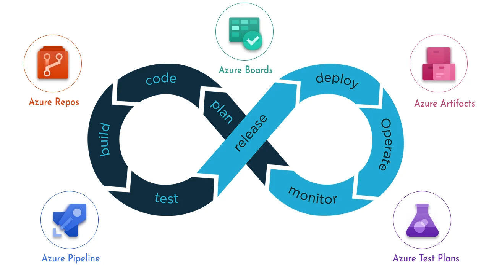

# Azure Devops


## ¿Qué es?

Azure DevOps es un conjunto de servicios y herramientas proporcionado por Microsoft para optimizar el ciclo de desarrollo de software. Está diseñado para admitir el desarrollo, implementación y gestión de aplicaciones en la nube utilizando prácticas de DevOps. Aquí tienes una descripción más detallada:

- **Azure Boards**: Ofrece un conjunto de herramientas ágiles para planificación, seguimiento, gestión de defectos y problemas mediante los métodos Kanban y Scrum.
- **Azure Repos**: Proporciona repositorios de Git o control de versiones de Team Foundation (TFVC) para el control de código fuente.
- **Azure Pipelines**: Ofrece servicios de compilación y versión para admitir la integración continua y la entrega de aplicaciones.
- **Azure Test Plans**: Proporciona herramientas para probar aplicaciones, incluyendo pruebas manuales o exploratorias y pruebas continuas.
- **Azure Artifacts**: Permite a los equipos compartir paquetes como Maven, npm, NuGet y más desde orígenes públicos y privados, e integrar el uso compartido de paquetes en las canalizaciones.

Ciclo de vida:


En resumen, Azure DevOps fomenta una cultura colaborativa y un conjunto de procesos que reúnen a desarrolladores, administradores de proyectos y colaboradores para desarrollar software de manera más rápida y eficiente que los enfoques tradicionales. Puedes trabajar en la nube con *Azure DevOps Services* o localmente con *Azure DevOps Server*. Además, admite la adición de extensiones y la integración con otros servicios populares, como Campfire, Slack, Trello, UserVoice, entre otros. ¡Es una herramienta poderosa para impulsar tus proyectos de desarrollo! 🚀

```
💚 La gente de Platzi destaca además:

CARACTERÍSTICAS:
- Inicialmente conocida como Visual Studio Online
- Cubre todo el proceso de desarrollo (no necesitamos nada más)
- Puedes iniciar completamente gratis
- Buena integración los 3 principales proveedores de la nube (AWS, Azure, GCP)

```

🔗 [¿Qué es Azure DevOps?](https://learn.microsoft.com/es-es/azure/devops/user-guide/what-is-azure-devops?view=azure-devops)


### Azure DevOps Server
``` Azure DevOps en tu propia infraestructura```  
 Esta versión nos permite Instalar en nuestra propia Infraestructura los servicios de Azure DevOps con un esfuerzo bastante grande y limitada, debe ser considerada por seguridad o políticas de compañía. [El licenciamiento se da por usuario o por servicios Individuales. ](https://azure.microsoft.com/en-us/pricing/details/devops/azure-devops-services/)

 ## Creación de cuenta Azure Devops
 El único requisíto que tenemos para crear una cuenta en *Azure Devops* es tener una cuenta de *Outlook, Github o de O365*.

 Para abrir la cuenta basta con acceder a la [página principal de Azure DevOps](https://azure.microsoft.com/es-es/products/devops) y registrarse siguiendo los pasos.

 ## Proyectos y organizaciones

En Azure DevOps, los conceptos de proyectos y organizaciones son fundamentales para estructurar y gestionar el desarrollo de software. 

### Organización:
- Cuando te conectas a Azure DevOps, te unes a una organización. Esta organización es el contenedor principal que agrupa todos los recursos relacionados con el desarrollo de software.
  
- **Dentro de la organización, puedes definir uno o varios proyectos**. La organización proporciona el contexto global para administrar y estructurar tus proyectos.

### Proyecto:
- Un proyecto en Azure DevOps es un espacio donde los equipos pueden colaborar para planificar, realizar un seguimiento del progreso y crear soluciones de software.
- Cada proyecto actúa como un contenedor fundamental donde puedes almacenar datos y código fuente.
- Al crear un proyecto, Azure DevOps automáticamente crea un equipo con el mismo nombre. Esto es suficiente para pequeñas organizaciones.
- Sin embargo, en organizaciones más grandes, es posible que necesites escalar verticalmente y crear más equipos y proyectos.
- Puedes tener hasta 1000 proyectos dentro de una organización en Azure DevOps.

### Estructura de Proyectos y Equipos
- Imagina un proyecto como un bloque de construcción básico. Varios proyectos y equipos forman la estructura completa de tu organización.
- Esta estructura permite a los equipos configurar las herramientas de maneras que funcionen para ellos y completar tareas administrativas en los niveles adecuados.
- A medida que la organización crece, las herramientas pueden adaptarse para apoyar una cultura de autonomía del equipo y alineación organizativa.

### Escalado y Administración
Puedes escalar tu organización de varias maneras:
- Agregar proyectos para admitir diferentes unidades de negocio.
- Crear equipos dentro de un proyecto.
- Agregar repositorios y ramas.
- Configurar agentes y grupos de agentes para la integración y entrega continua.
- Administrar el acceso a través de identificadores de entrada de Microsoft para gestionar un gran número de usuarios.

En resumen, las organizaciones proporcionan el contexto global, mientras que los proyectos son los espacios específicos donde se lleva a cabo el desarrollo colaborativo de software en Azure DevOps 🚀     

## Configuración CI/CD
La configuración de un proyecto de desarrollo con integración continua y despliegue continuo medianto Azure Devops es una labor relativamente sencilla en comparación con esta misma labor en condiciones más "artesanales".
Podemos realizar la configuración de nuestras **pipelines** para llevar el desarrollo hasta producción en algún servicio de hosting sin salir del navegador y utilizando unicamente las configuraciones que proporciona *Azure Devops*.
Debido a la variedad de opciones, servicios y tipos de proyectos no se detalla aquí un "manual" directo para hacerlo. Es conveniente estudiar cada caso particular para optar por una configuración u otra.