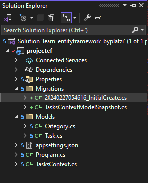
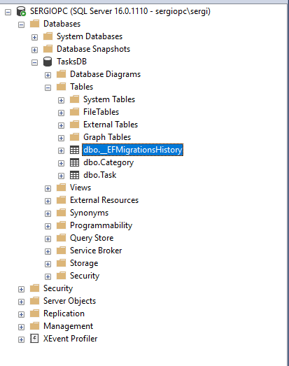

# Migraciones

🔗 [Microsoft documentation](https://learn.microsoft.com/es-es/ef/core/managing-schemas/migrations/?tabs=dotnet-core-cli)

Las migraciones permiten actualizar de manera incremental el esquema de la base de datos para mantenerlo sincronizado con el modelo de datos de la aplicación. Cuando se realizan cambios en el modelo de datos (por ejemplo, se agregan o eliminan entidades o propiedades), las migraciones describen las actualizaciones necesarias para reflejar esos cambios en la base de datos.

⚠️ El control de la base datos mediante *EF Migrations* debe realizar desde el principio, antes de crear la base de datos en nuestro motor de SQL.

## Proceso de trabajo con migraciones:

- **Creación de migraciones:** Cuando se introduce un cambio en el modelo de datos, se crea una migración correspondiente. Esta migración describe las modificaciones necesarias para mantener sincronizado el esquema de la base de datos.
- **Comparación de modelos:** EF Core compara el modelo actual con una instantánea del modelo anterior para determinar las diferencias.
- **Generación de archivos de origen:** Se generan archivos de origen de la migración, que se pueden rastrear en el control de código fuente del proyecto.
- **Aplicación de migraciones:** Las migraciones se aplican a la base de datos, y EF Core registra todas las migraciones aplicadas en una tabla de historial especial.

## Ejemplo práctico

Imagine que acaba de completar la primera aplicación de EF Core, que contiene el siguiente modelo simple:

``` cs
 public class Blog
{
    public int Id { get; set; }
    public string Name { get; set; }
}
```

Durante el desarrollo, puedes iterar rápidamente y cambiar el modelo según las necesidades. Sin embargo, cuando la aplicación se destina a producción, necesitas una forma segura de actualizar el esquema sin eliminar toda la base de datos.

### Primera migración
Instala las herramientas de línea de comandos de EF Core
> dotnet tool install --global dotnet-ef

 y crea la primera migración.

> dotnet ef migrations add InitialCreate

EF Core creará un directorio denominado *Migrations* en el proyecto y generará varios archivos. Es recomendable inspeccionar lo que EF Core ha generado exactamente. En mi caso:



 


### Creación de la base de datos y el esquema

En este momento puede hacer que EF cree la base de datos y el esquema a partir de la migración. Esto también se puede hacer mediante:

> dotnet ef database update

Eso es todo, la aplicación está lista para ejecutarse en la base de datos nueva y no es necesario escribir una sola línea de SQL. Tenga en cuenta que esta manera de aplicar migraciones resulta idónea para el desarrollo local, pero es menos adecuada para los entornos de producción.


## Cambios posteriores
Han pasado unos días y le piden que agregue una marca de tiempo de creación a los blogs. Ha realizado los cambios necesarios en la aplicación y el ahora modelo tiene este aspecto:

```cs
public class Blog
{
    public int Id { get; set; }
    public string Name { get; set; }
    public DateTime CreatedTimestamp { get; set; }
}
```
Ahora el modelo y la base de datos de producción están desincronizados; tendrá que agregar una nueva columna al esquema de la base de datos. Cree una migración para esto:

> dotnet ef migrations add AddBlogCreatedTimestamp

Tenga en cuenta que a las migraciones se les proporciona un nombre descriptivo para que después sea más fácil entender el historial del proyecto.

Como no se trata de la primera migración del proyecto, ahora EF Core compara el modelo actualizado con una instantánea del modelo anterior, antes de que se agregara la columna; la instantánea del modelo es uno de los archivos generados por EF Core cuando se agrega una migración y se inserta en el control de código fuente. En función de esa comparación, EF Core detecta que se ha agregado una columna y agrega la migración adecuada.

Ahora puede aplicar la migración como antes:

> dotnet ef database update

Tenga en cuenta que, en esta ocasión, EF detecta que la base de datos ya existe. Además, cuando antes se ha aplicado la primera migración, esta operación se ha registrado en una tabla de historial de migraciones especial en la base de datos, lo que permite que EF solo aplique de forma automática la nueva migración.


## Exclusión de elementos del modelo
En ocasiones, es posible que quiera consultar tipos de otro DbContext. Esto puede dar lugar a conflictos de migración. Para evitarlo, excluya el tipo de las migraciones de uno de los elementos DbContext.

```cs
protected override void OnModelCreating(ModelBuilder modelBuilder)
{
    modelBuilder.Entity<IdentityUser>()
        .ToTable("AspNetUsers", t => t.ExcludeFromMigrations());
}
```


## Pasos siguientes
Lo anterior solo era una breve introducción a las migraciones. Consulte las demás páginas de documentación para obtener más información sobre cómo administrar migraciones, aplicarlas y otros aspectos. La referencia de herramientas de la CLI de .NET Core también contiene información útil sobre los distintos comandos.


## Instalación de paquetes necesarios

Buscar en nuget.org *Microsoft.EntityFrameworkCore.Design* y copiar/ejecutar el comando, en mi caso:

> dotnet add package Microsoft.EntityFrameworkCore.Design --version 8.0.2

> dotnet tool install --global dotnet-ef


## Comandos básicos

> dotnet ef migrations add InitialCreate

> dotnet ef database update

> dotnet ef migrations add MyMigration

 