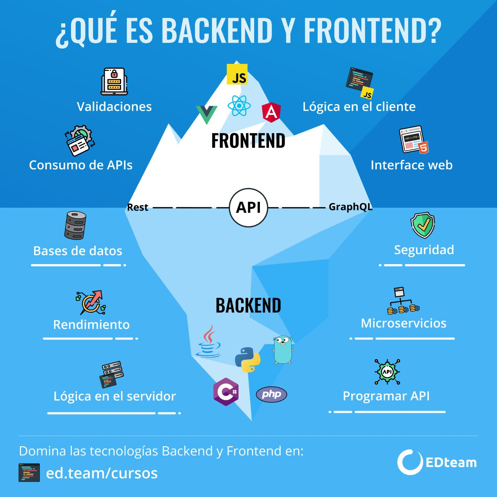

# ¿Qué es el backend?

El backend en programación se refiere a la parte no visible de un sistema de software, aplicación o sitio web. Es la capa de la aplicación que se encarga de procesar la lógica, la gestión de datos, la seguridad y la comunicación con el servidor y las bases de datos. En otras palabras, es “lo que está detrás” y “lo que no se ve”. Aquí tienes algunos puntos clave sobre el backend:

1. Arquitectura Interna: El backend es la arquitectura interna de un sitio web. Aunque no es visible para los usuarios, es esencial para que todos los elementos de la web funcionen correctamente.
2. Funcionalidad y Seguridad: Los desarrolladores backend se encargan de desarrollar la funcionalidad del sitio, así como de garantizar la seguridad y la optimización de los recursos. Esto incluye la comunicación con el servidor y la gestión de datos.
3. Lenguajes Implicados: Los desarrolladores backend trabajan con varios lenguajes de programación, como Java, PHP, .Net, Python, Ruby o Node.js. Estos lenguajes son fundamentales para crear la lógica interna de una aplicación o sitio web.
   
En contraste, el frontend es la parte visible de un programa. Es lo que el usuario ve e interactúa directamente en el navegador, incluyendo imágenes, animaciones y elementos visuales2. En resumen, el backend es la base que permite que todo funcione correctamente, mientras que el frontend se encarga de la presentación visual en el navegador.

*¿Qué es backend y fronted?* en aplicaciones web según la gente de EDteam:

Tomando como base un modelo cliente- servidor, se suele usar el término “backend” para referirse al software ejecutado en el servidor.
