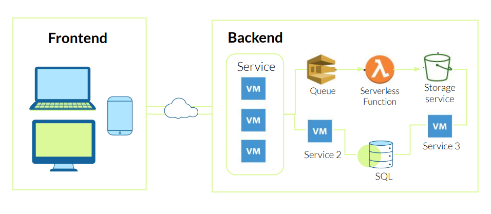
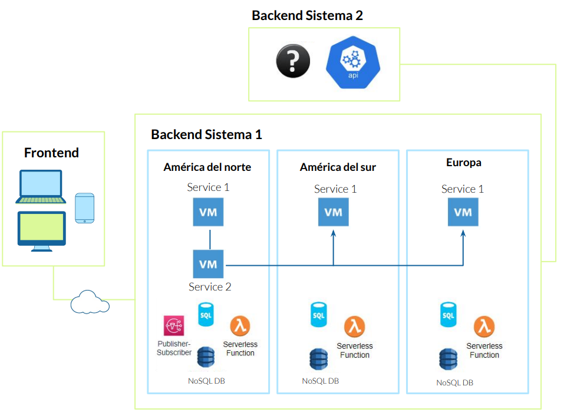

# Sistemas distribuidos

## Introducción 

Comenzemos identificando y señalando las diferencias entre un *sistema monolítico* y un *sistema distribuido*.

➔ **Sistema Monolítico**: sistema conformado por una sola 
“pieza”  
➔ **Sistema Distribuido**: sistema Compuesto de múltiples componentes que se comunican entre sí usando redes

Un ejemplo de [sistema monolítico](https://microservices.io/patterns/monolithic.html) podría ser un único servidor que hospeda uno o más sitios web con LAMP stack.

### LAMP Stack

Un [LAMP Stack](https://aws.amazon.com/es/what-is/lamp-stack/) es un conjunto de cuatro tecnologías de software que los desarrolladores utilizan para crear sitios web y aplicaciones web. El acrónimo LAMP proviene de las siguientes componentes:

1. **Linux**: Es el sistema operativo base. Linux es gratuito y de código abierto, lo que significa que cualquiera puede utilizarlo sin pagar tarifas de licencia.
2. **Apache**: Es el servidor web que maneja las solicitudes HTTP y sirve páginas web a los navegadores de los usuarios. Apache es ampliamente utilizado y probado en el campo de la web.
3. **MySQL**: Es el servidor de base de datos. MySQL almacena y gestiona los datos utilizados por las aplicaciones web. Es una opción popular para aplicaciones que requieren bases de datos relacionales.
4. **PHP**: Es el lenguaje de programación utilizado para crear la lógica interna de las aplicaciones web. PHP permite a los desarrolladores generar contenido dinámico y procesar formularios, entre otras tareas
¿Por qué es importante un LAMP Stack?

Los desarrolladores web eligen un LAMP Stack por varias razones:

- **Costo**: Todas las tecnologías LAMP son de código abierto, lo que significa que no se requieren pagos de licencia. Esto reduce los costos de desarrollo de aplicaciones web.
- **Eficiencia**: El LAMP Stack es una solución probada y comprobada. Los desarrolladores pueden centrarse en crear aplicaciones en lugar de preocuparse por la configuración y pruebas rigurosas.
- **Mantenimiento**: La comunidad de código abierto mantiene y actualiza regularmente estas tecnologías para que sigan siendo relevantes y seguras.
- **Soporte**: La comunidad global de TI ofrece apoyo y recursos para los usuarios de LAMP Stack.
- **Flexibilidad**: Aunque la arquitectura LAMP especifica componentes, los desarrolladores pueden personalizarlos según sus necesidades.
- 
En resumen, un LAMP Stack se utiliza para el desarrollo del backend o lado del servidor de aplicaciones web. Es la base invisible que permite que todo funcione correctamente mientras el frontend se encarga de la presentación visual en el navegador.

## Definición formal

Un sistema distribuido es un conjunto de programas informáticos que utilizan recursos computacionales en varios nodos de cálculo distintos para lograr un objetivo compartido común. Estos sistemas, también conocidos como “computación distribuida” o “bases de datos distribuidas”, utilizan nodos distintos para comunicarse y sincronizarse a través de una red común. Aquí tienes algunas características clave de los sistemas distribuidos:

1. **Recursos compartidos**: Los sistemas distribuidos pueden compartir hardware, software o datos.
2. **Procesamiento simultáneo**: Varias máquinas pueden procesar la misma función al mismo tiempo.
3. **Escalabilidad**: La capacidad computacional y de procesamiento puede escalarse hacia arriba según sea necesario al añadir máquinas adicionales.
4. **Detección de errores**: Los errores se pueden detectar más fácilmente.
5. **Transparencia**: Un nodo puede acceder a otros nodos del sistema y comunicarse con ellos.

En contraste, un *sistema centralizado* es aquel en el que todos los cálculos los realiza un solo ordenador en una ubicación. La principal diferencia entre un sistema centralizado y un sistema distribuido es el patrón de comunicación entre los nodos del sistema. Mientras que en un sistema centralizado, el estado se encuentra dentro de un nodo central al que los clientes acceden, en los sistemas distribuidos, los nodos comparten mensajes entre sí para lograr objetivos comunes. Además, los sistemas centralizados tienen un punto de error único, mientras que los sistemas distribuidos pueden ser más resilientes.

Ejemplo: 

## Elementos que podemos encontrar

➔ Load Balancers  
➔ Máquinas Virtuales  
➔ Bases de Datos (Relacionales y No Relacionales)  
➔ Servicios de Colas (ej. SQS)  
➔ Servicios de Storage (ej. S3)  
➔ Servicios Publisher-Subscriber (ej. SNS)  
➔ Pipelines  
➔ etc.  

¿Hasta dónde puede llegar o crecer un sistema distribuido?

## ¿Cómo se conecta todo en el backend?

El backend de un sistema puede estar conformado por múltiples componentes para su funcionamiento. 
Sin embargo, independientemente de la implementación, generalmente debe exponer una **API (Interfaz de Programación de Aplicaciones).**