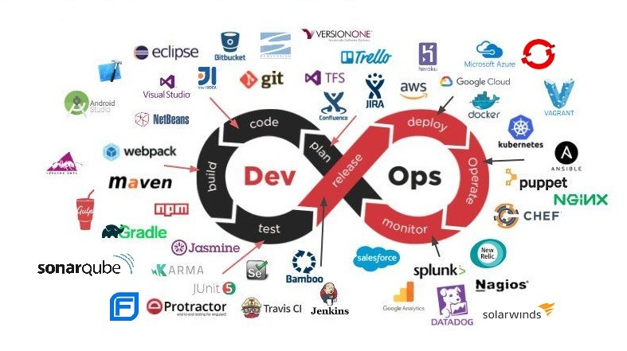

# ¿Qué es DevOps?

DevOps es un proceso de desarrollo de software y un cambio cultural empresarial que acelera la entrega de software de alta calidad mediante la automatización e integración de los esfuerzos de los equipos de desarrollo y operaciones de TI. Tradicionalmente, estos dos grupos trabajaban de manera independiente o en silos. Sin embargo, DevOps busca unir a las personas, los procesos y la tecnología en el planeamiento, desarrollo, entrega y operaciones de las aplicaciones.

Ciclo de vida y herramientas principales:



Aquí hay algunos puntos clave sobre DevOps:

1. **Colaboración**: DevOps promueve la colaboración entre todos los roles involucrados en el desarrollo y mantenimiento de software. Se basa en la integración entre desarrolladores de software y administradores de sistemas.
2. **Metodología ágil**: DevOps se basa en una metodología ágil de desarrollo. En lugar de lanzamientos masivos de código cada varios meses o años, se enfoca en actualizaciones más pequeñas y frecuentes al código base de la aplicación.
3. **Objetivos**: DevOps busca satisfacer la creciente demanda de los usuarios de software para obtener características nuevas, frecuentes e innovadoras, así como un alto rendimiento y disponibilidad sin interrupciones.  

En resumen, DevOps es una cultura que impulsa la entrega continua de software de alta calidad, adaptándose a las cambiantes necesidades empresariales y tecnológicas.

🔗 [Azure - ¿Qué es DevOps?](https://azure.microsoft.com/es-es/resources/cloud-computing-dictionary/what-is-devops/)

🔗 [Microsoft Learn - ¿Qué es DevOps?](https://learn.microsoft.com/es-es/devops/what-is-devops)


```
💚 La gente de Platzi destaca además:

Características:
    - El concepto aparece en el 2009.
    - Cultura de mejora continua que involucra cada uno de los aspectos de TI y procesos de desarrollo
    - Se enfoca en procesos, personas y herramientas

No confundir DevOps con:
    - Un puesto de trabajo
    - Una herramienta
    - Una metodología ágil
    - Una tecnología
    - Un rol

DevOps va de la mano con:
    - Agilismo
    - Automatización
    - Soporte de infraestructura
    - Integración continua y despliegue continuo

```


