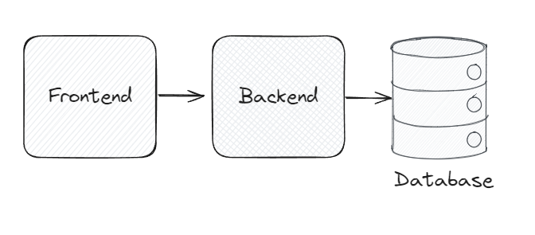
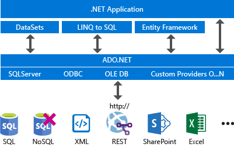

# Conexión a base de datos

## Arquitectura básica en una aplicación real

*Entity Framework* nos facilita la conexión y acceso a la base de datos.

## Tipos de conexión

En Windows tenemos diferentes componentes para realizar la conexión a base de datos:

- ODBC
- OLEBD
- SQL Server
- Conexión Azure SQL

Todos estos métodos implican el uso de una cadena de conexión como punto inicial de configuración para poder acceder a la base de datos.

## ADO.NET
Dentro de .NET tenemos un componente que nos permite realizar todas las conexiones anteriores. Es ADO.NET.

Es un conjunto de librerías que nos permite acceder a base de datos y servicios de datos. 
- Podemos acceder a distintos orígenes de datos:
  - SQL Server
  - Excel
  - Access
  - SharePoint 
  - ...

Arquitectura básica:

Los medios para utilizar la información que ADO.NET está procesando son:
- DataSets
- LINQ to SQL (ya no se utiliza mucho)
- **Entity Framework** (es el medio más utilizado actualmente, *2024*)