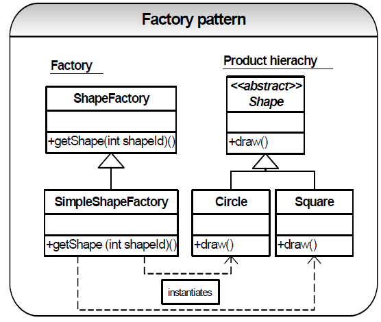
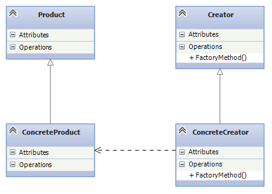

# Catálogo de patrones de diseño

- [Catálogo de patrones de diseño](#catálogo-de-patrones-de-diseño)
  - [Patrones creacionales](#patrones-creacionales)
    - [Singleton 🕴️](#singleton-️)
    - [Factory Method 🏭](#factory-method-)
  - [Patrones de comportamiento](#patrones-de-comportamiento)
    - [Dependency Injection](#dependency-injection)

## Patrones creacionales

### Singleton 🕴️
Singleton nos permite asegurarnos de que una clase tenga una única instancia. Proporciona un punto de acceso global a dicha instancia.

✅ **USO RECOMENDADO**
- **Gestión de configuraciones**
  Cuando necesitas almacenar configuraciones que deben ser consistentes y accesibles desde diferentes módulos, el Singleton es una opción válida.
- **Acceso a una base de datos**
  Si deseas tener una única instancia de una clase para acceder a una base de datos desde cualquier parte del código, el Singleton es apropiado.
- **Gestión de Logs**
  Para centralizar la gestión de logs y asegurar que sólo haya una instancia encargada de registrar eventos, el Singleton es una buena opción.

❌ **USO NO RECOMENDADO**
- No lo uses para almacenar **datos sensibles**. 
  La disponibilidad global del Singleton dificulta rastrear qué partes del programa están afectadas si se realizan cambios en él.
- Evita usarlo en **situaciones concurrentes sin tomar precauciones** adecuadas. Si hay llamados concurrentes al Singleton, pueden surgir problemas. En este caso sería necesaria una implementación especial y segura del Singleton.

⚠️ **CONSIDERACIONES**
 
 - El patrón singleton habitual puede dar problemas en determinadas circunstancias como el uso de hilos o reflexión. Procura implementar el patrón de una manera robusta.

- Muchos desarrolladores consideran el patrón Singleton un antipatrón. Por este motivo, su uso está en declive en el código C#.

### Factory Method 🏭

El patrón Factory, también conocido como Método Factoría, permite crear objetos sin especificar su clase exacta.

Esto significa que el objeto creado puede intercambiarse con flexibilidad y facilidad.

Para implementar este método, los desarrolladores utilizan el Factory Method, que es el corazón de este patrón.

**¿Cuál es la finalidad del patrón Factory?**
- El objetivo principal es separar la creación de objetos de los propios objetos.
- En lugar de usar un constructor de clase normal, el Factory Method toma su lugar.
- Esto permite seguir los principios SOLID, que son fundamentales en el diseño orientado a objetos.

**¿Cómo funciona el patrón Factory Method?**
- Se crea una interfaz o clase abstracta que define los métodos necesarios para crear un objeto.
- La implementación de esos métodos se deja a las subclases.
- Cada subclase puede decidir qué clases instanciar y cómo realizar la creación de objetos.
- Ejemplos de esquema de creación:
  
    

  

**Ventajas e inconvenientes del patrón de diseño Factory:**
- **Ventajas**: 😀
    - Flexibilidad: Permite cambiar las implementaciones sin afectar al código cliente.
    - Reusabilidad: Facilita la creación de nuevas subclases sin alterar la estructura existente.
- **Inconvenientes**: 😔
    - Complejidad: Puede aumentar la complejidad del código al introducir más clases e interfaces.

**¿Cuándo se utiliza el patrón Factory?**
  - Utiliza el patrón Factory cuando necesites crear objetos de manera flexible y desacoplada.
  - Es especialmente útil cuando no conoces la clase exacta del objeto que debes crear.

En resumen, el patrón Factory Method es una herramienta poderosa para crear objetos de manera dinámica y modular. Ayuda a mantener un código limpio y extensible, permitiendo que las subclases tomen decisiones sobre la creación de objetos.

## Patrones de comportamiento

### Dependency Injection

*Inyección de dependencias* es un patrón de diseño orientado a objetos, en el que se suministran objetos a una clase en lugar de ser la propia clase la que cree dichos objetos. Esos objetos cumplen contratos que necesitan nuestras clases para poder funcionar (de ahí el concepto de dependencia). Nuestras clases no crean los objetos que necesitan, sino que se los suministra otra clase 'contenedora' que inyectará la implementación deseada a nuestro contrato.

En otras palabras, se trata de un patrón de diseño que se encarga de extraer la responsabilidad de la creación de instancias de un componente para delegarla en otro. El término fue acuñado por primera vez por Martin Fowler.

**Inyección de Dependencias vs. Inversión de Dependencias**
La *inversión de dependencias* es uno de los 5 principios SOLID de la programación orientada a objetos. Y la *inyección de dependencias* es un patrón de diseño que nos permite implementar 2 de los principios SOLID: **Interface Segregation** y **Dependency Inversion**.

