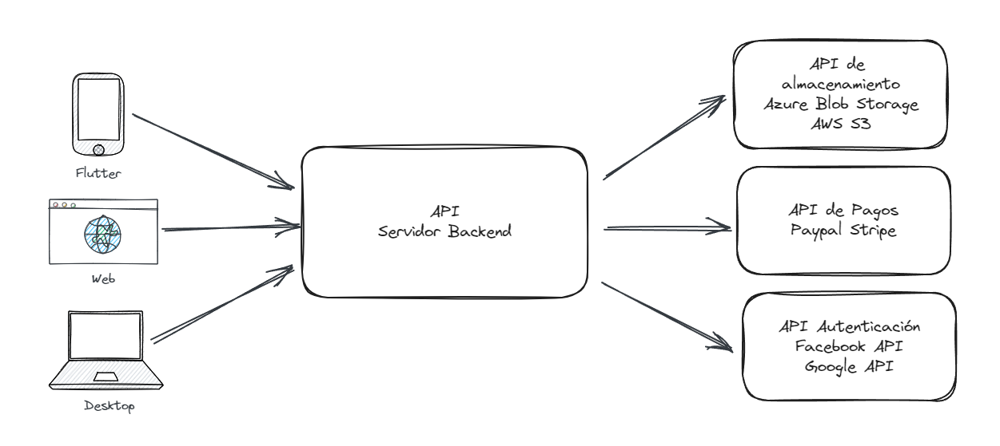

# ¿Qué es una API web?

Una API (**Application Programming Interface**) es un conjunto de definiciones y protocolos que se utilizan en el desarrollo web y de software. Su función principal es permitir que diferentes aplicaciones interactúen entre sí de manera segura y eficiente. 

Puntos clave:

- **Definición**: Una API establece cómo un módulo de software se comunica o interactúa con otro para cumplir una o muchas funciones.
- **Comunicación entre Aplicaciones:** Las APIs permiten que distintas aplicaciones se conecten y compartan datos mediante solicitudes y respuestas. Por ejemplo, cuando abres un juego en tu teléfono móvil y te conectas a tu cuenta de Facebook para iniciar sesión, estás utilizando una API. También, cuando una aplicación te envía notificaciones al móvil o al ordenador, está utilizando una API.
- **Funciones y Usos:** Las APIs pueden ser privadas (para uso exclusivo de una empresa), abiertas (para socios) o públicas (para cualquier desarrollador). Pueden ser locales (para aplicaciones que se comunican dentro de un mismo ambiente o dispositivo) o remotas (cuando se necesita acceder a otro punto diferente).
  
En resumen, las APIs son los circuitos internos que permiten que las aplicaciones funcionen juntas de manera segura y eficiente, aunque no sean visibles para los usuarios finales.

El equipo de [Platzi](https://platzi.com/) destaca así sus características principales:
- Exponer métodos y funciones para ser 
consumido por otras aplicaciones.
- Posee una capa de abstracción para ser 
consumida. 
- Puede tener capas de seguridad que brinden 
autenticación y autorización

Ejemplo de consumo típico de APIs:

## Preguntando a Copilot

Las APIs web pueden clasificarse en varios tipos, cada uno con sus características y usos particulares. A continuación, te presento algunos de los principales tipos:

### APIs de Navegador
Estas APIs están integradas en tu navegador web y permiten interactuar con el entorno del navegador y el sistema informático circundante.
Algunos ejemplos de APIs de navegador son:
- API de Geolocalización: Proporciona funciones para obtener datos de ubicación, como la latitud y longitud del dispositivo.
- API de Notificaciones: Permite enviar notificaciones al usuario desde una página web.
- API de Almacenamiento Local: Facilita el almacenamiento de datos en el navegador.
  
###  APIs de Servicios Web
Estas APIs se utilizan para comunicarse con servicios remotos a través de la web.
Algunos tipos comunes de APIs de servicios web son:
- **REST** (Representational State Transfer): Utiliza el protocolo HTTP para acceder a recursos y datos en la web.
- **SOAP** (Simple Object Access Protocol): Basado en XML, se utiliza para intercambiar información estructurada entre aplicaciones.
- **GraphQL**: Permite a los clientes solicitar solo los datos que necesitan, lo que mejora la eficiencia en la transferencia de información.
- **gRPC**: Un protocolo de comunicación de alto rendimiento basado en HTTP/2 y protobuf.
  
###  APIs de Datos
Estas APIs se utilizan para acceder y manipular datos almacenados en bases de datos u otros sistemas.
Ejemplos:
- APIs de Bases de Datos: Conectan aplicaciones con sistemas de gestión de bases de datos.
- APIs de Redes Sociales: Permiten acceder a datos de plataformas como Facebook, Twitter o Instagram.
  
###  APIs de Sistemas Operativos
Estas APIs interactúan con los recursos y servicios del sistema operativo.
Ejemplos:
- APIs de Archivos: Para leer y escribir archivos en el sistema de archivos.
- APIs de Procesos: Controlan la ejecución de procesos y aplicaciones.

En resumen, las APIs web son herramientas esenciales para conectar aplicaciones y servicios, y existen diversos tipos según su funcionalidad y contexto de uso