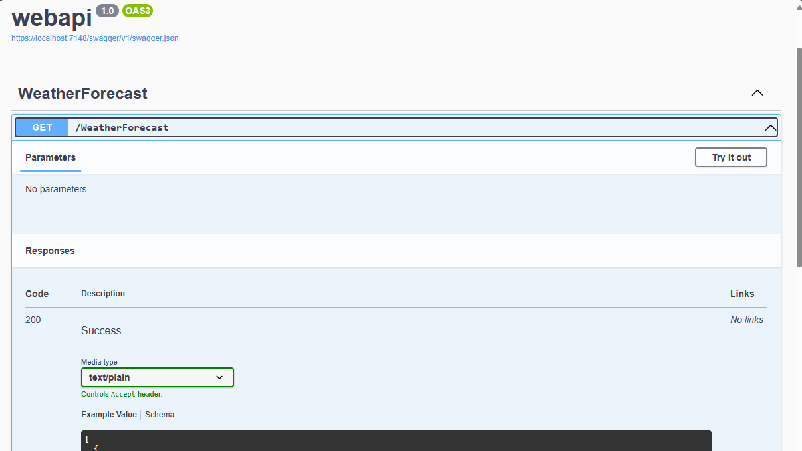

# ¿Qué es Swagger?

Swagger es una herramienta fundamental en el desarrollo de APIs. Permíteme explicarte sus características y utilidades:

- Documentación Online: Swagger genera documentación online para una API. En esta herramienta, puedes ver todos los endpoints que has desarrollado en tu API. Además, muestra cómo son los elementos o datos que debes pasar para que funcione y te permite probarlos directamente en su interfaz.
- Prueba Directa: Para probar los elementos de tu API en Swagger, simplemente haz clic sobre un endpoint. Verás un botón que dice “try it out”. Por ejemplo, si tu API tiene un endpoint de registro de usuarios, Swagger te permitirá probar la creación de un usuario y editar el código. Luego, al hacer clic en el botón azul “Execute”, ejecutarás el código editado y obtendrás la respuesta correspondiente.
- Inspección del Navegador: Te recomiendo abrir la ventana de inspección de tu navegador mientras trabajas con Swagger. Allí, dirígete a la sección “Network” y marca “Fetch/XHR”. Esto te permitirá ver cómo se hacen las peticiones en el frontend. Observar cómo está montada la petición, las cabeceras y la respuesta te ayudará a entender cómo debes crear dicha petición en tu código.
- Bloqueo de Endpoints: Si ves un símbolo de candado en algunos de tus endpoints, significa que están protegidos y requieren un token para acceder a sus respuestas.

En resumen, Swagger es una herramienta esencial para diseñar, documentar y probar APIs de manera estandarizada, facilitando la comunicación y colaboración entre desarrolladores y equipos que trabajan en proyectos relacionados con APIs

🔗 [Documentación oficial Swagger](https://learn.microsoft.com/en-us/aspnet/core/tutorials/web-api-help-pages-using-swagger?view=aspnetcore-8.0)